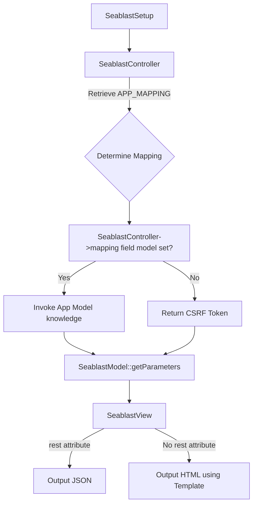

# Seablast Logic Overview

1. **SeablastSetup**: Combines various configuration files into a unified configuration.

2. **SeablastController**: Applies the configuration and determines the appropriate mapping based on the URL and superglobals. The mapping is retrieved from `APP_MAPPING` and assigned to `string[] mapping`. If `mapping['roleIds']` is set, the IdentityManager comes into play here.

3. **SeablastModel**:

   - Invokes the `knowledge()` method of the app model if `controller->mapping['model']` is set.
   - Passes the results through `getParameters()` to standardize output.
   - If no model is set, it returns a CSRF token via `getParameters()`.

4. **SeablastView**:
   - Uses data from `SeablastModel::getParameters()` to render the final output as JSON (if `rest` is present) or HTML (using a template).

This diagram illustrates the flow from setup through to final output, highlighting key decision points and interactions between components in the Seablast framework.
