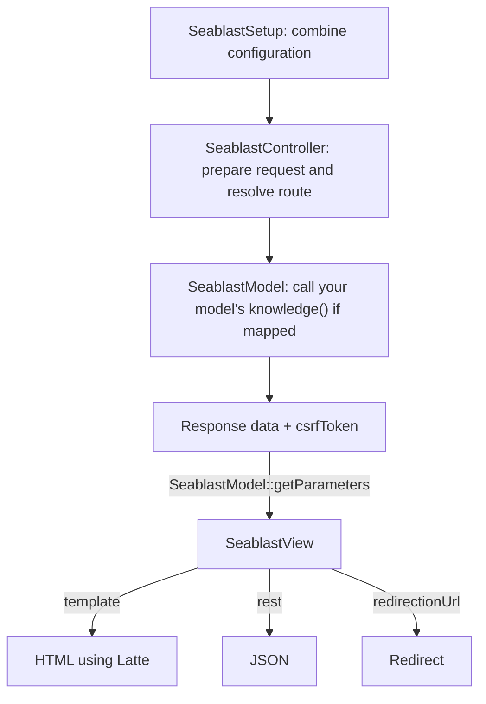

# Seablast Logic Overview

Seablast connects an incoming request to your application's logic and presentation through MVC.
Your application provides configuration, routes, models, and templates; the framework coordinates the request lifecycle.

1. **SeablastSetup — configuration**: Combines framework defaults, optional package settings, and your application's and environment configuration into one `SeablastConfiguration`.

2. **SeablastController — request routing**: Prepares the request environment and session, selects a route from `SeablastConstant::APP_MAPPING` by URL, and enforces the route's access rules through the configured identity manager. The route identifies your application's model and template.

3. **SeablastModel — application logic**: Creates the mapped application model with configuration and `Superglobals` (request and session data), then calls its `knowledge()` method. Your model performs the application logic and returns a `stdClass` containing response data. Seablast always adds `csrfToken` and passes the object to the view through `getParameters()`. Routes without a model start with an empty object, so they can render a template without custom logic.

4. **SeablastView — response**: Uses the model's data to render the selected Latte template, with `configuration` also available to the template. Your model can instead set `rest` for a JSON response or `redirectionUrl` for a redirect, and optionally set `httpCode` for the response status. Use one response mode per result.

```mermaid
flowchart TD
    A["SeablastSetup: combine configuration"] --> B["SeablastController: prepare request and resolve route"]
    B --> C["SeablastModel: call your model's knowledge() if mapped"]
    C --> D["Response data + csrfToken"]
    D -->|SeablastModel::getParameters| E["SeablastView"]
    E -->|template| F["HTML using Latte"]
    E -->|rest| G["JSON"]
    E -->|redirectionUrl| H["Redirect"]
```

This diagram shows the normal application flow. Before application logic runs, Seablast validates the request context and applies session cookie policy, using verified HTTPS and client IP information. Request validation, maintenance mode, or access rules can stop normal processing or direct it to an error response.

For practical application setup, see [AGENT-STARTER-KIT.md](../AGENT-STARTER-KIT.md).
For framework internals and detailed runtime contracts, see [AGENTS.md](../AGENTS.md).
